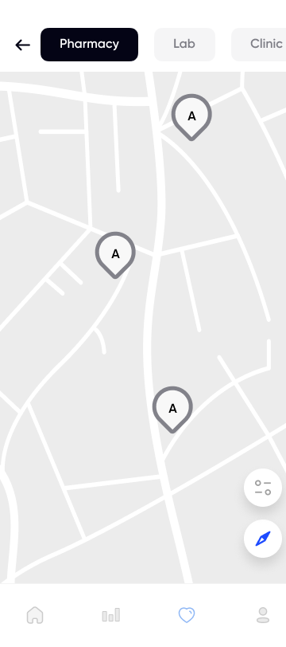

# ReVita Backend Part of the App
___
ReVita contributes to preventing deaths from post-transplantation hardships. Moreover, our app contributes to achieving universal health coverage, automates and enhances many medical procedures such as patient health tracking, reviewing medical history and promotes physical and mental well-being.
## Link For Backend Part 
___ 
https://github.com/ndimqa/gdsc_back

## Overview
___
Every year, `thousands` of people around the world undergo organ transplantations. In 2021 alone, there were more than `140000` organ recipients. <br>
The mobile application that we propose offers the users an ability to: <br>
* Keep track of necessary medical information such as blood pressure, blood oxygen level and heartbeat
* Provides user with medication, contacts, appointment and analyzes organizer and reminder
* Create safe space for users by providing reliable information on physical activity accredited by European Transplant Sports Symposium and mental health related articles from trusted sources

## Demo Video
___

> Youtube Video Link: https://www.youtube.com/watch?v=g_z2eqk4_u8

## Table of Content
___
  <ol>
    <li><a href="#technologies">Technologies</a></li>
    <li><a href="#un-sustainable-development-goals-and-targets">UN Sustainable Development Goals And Targets</a></li>
    <li><a href="#core-functionalities">Core Functionalities</a></li>
    <li><a href="#distribution">Distribution</a></li>
  </ol>

## Technologies
___

<div align="center">
	
	
	
 	
	
	
    
    
    
</div>

## UN Sustainable Development Goals And Targets
___
### SDG 3: Good Health and Well-being


> 3.4.1 - preventing the deaths from cardiovascular diseases, cancer and chronic respiratory diseases.

> 3.8 - Achieve universal health coverage, including financial risk protection, access to quality essential health-care services and access to safe, effective, quality and affordable essential medicines and vaccines for all.
### SDG 9: Quality Education


> 9.5 - Enhance scientific research, upgrade the technological capabilities of industrial sectors in all countries, in particular developing countries, including by 2030, encouraging innovation and substantially increasing the number of research and development workers per 1 million people and public and private research and development spending.

- This app can contribute to achieving universal health coverage by providing patients with access to quality health care services through their mobile devices
- Developing this app would require scientific research and the use of innovative technologies, which aligns with this target. 
- We chose these goals because we ourselves have witnessed cases where the lack of automated processes and quality technology in health care affects thousands.

## Core Functionalities
___
### Pill Tracker
<div align="center">
	
  
	
</div>
Pill tracker to for necessary medicaments to stabilize immune system

### Activity/Medical Indicators Tracker
<div align="center">
	
	
  <div class="center-vertical">
    <div class="center-vertical">
      <div align="center">
          
          
          
      </div>
    </div>
    <div class="center-vertical">
      <div align="center">
          
          
          
      </div>
    </div>
    <div class="center-vertical">
      <div align="center">
        
        
        
      </div>
    </div>
  </div>
</div>

### Community chat
<div align="center">
	
	
  
</div>
Safe space for users is created by providing reliable information on physical activity accredited by European Transplant Sports Symposium and mental health related articles from trusted sources. Simple doctor appointment form using Google Meet and Google Sheets. Transplant community events and links to local community chats

### Medical articles digest
<div align="center">
	
</div>

### Data collection
Data gathering of medical indicators like blood pressure, blood oxygen level and heartbeat. It could be used for anomaly detection.

## Distribution
___
* This is the FrontEnd Part of the App.

To start you need to install flutter, see this link https://docs.flutter.dev/get-started/install

Then clone our repository to your machine by typing this into the terminal
```
git clone https://github.com/Zaykenov/solution_challenge.git
```
## Usage
After cloning the project, connect your mobile device or emulator and type this into the terminal 
```
flutter run
```
Developed by:

-   [Temirlan Zaykenov](https://github.com/Zaykenov)
-   [Yernur Beisenbek](https://github.com/YernurBeisenbek)
-   [Dinmukhamed Nuran](https://github.com/ndimqa)
